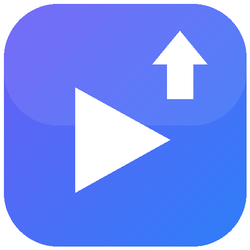

<p align="center">
  
</p>

<h1 align="center">TwitchDVR to YouTube</h1>

<p align="center">
  <a href="https://github.com/mrfroncu/TwitchDVR-to-YOUTUBE/releases/latest"></a>
  <a href="https://github.com/mrfroncu/TwitchDVR-to-YOUTUBE/actions/workflows/release.yml"></a>
  <a href="LICENSE"></a>
  
  
</p>

<p align="center">
  Automated YouTube uploads for <a href="https://github.com/MrBrax/LiveStreamDVR">LiveStreamDVR</a>
  Twitch recordings — metadata, chapters, playlists, automation and channel management.
</p>

---

A desktop app (plus a Docker/web version) that uploads
[LiveStreamDVR](https://github.com/MrBrax/LiveStreamDVR)
Twitch VOD recordings to YouTube — sequentially, with all the stream metadata carried over:

- **Title** from the Twitch stream/VOD title (templated, e.g. `{title} | {streamer} VOD {date}`)
- **Description** with the stream title, streamer link, date, game list and the original Twitch VOD ID
- **YouTube chapters** generated from Twitch title/game changes (rendered from timestamps in the description)
- **Tags** from the game names + streamer name
- **Recording date** set to the real stream date, **category** set to Gaming
- Editable per-video metadata, upload queue with reordering, progress/speed/ETA, resumable
  chunked uploads with automatic retry, and duplicate-upload protection (already-uploaded
  folders are remembered and skipped)
- **Post-upload verification**: after each upload the app asks the YouTube API whether the
  video actually exists and wasn't rejected/failed (shown as *verified* in the list; there is
  also a bulk "Verify on YouTube" action)
- **Checkboxes & bulk actions** in both lists: check rows (or click the ☐ column header for
  all) and bulk add-to-queue, reset metadata, set privacy, verify, remove from queue
- **Optional local cleanup**: after a *verified* upload, move the video file — or the whole
  VOD folder — to the Recycle Bin, automatically (Settings → "After verified upload") or
  manually via the bulk "🗑 Recycle local files" button. Files are never touched unless
  YouTube confirmed the video exists, and they go to the Recycle Bin, not permanent deletion.
- Modern Fluent-inspired UI with dark and light mode (Settings → Appearance), animated
  upload progress, and a theme-matched title bar — drawn natively, so it stays responsive
- **Multiple channels**: add several YouTube accounts/brand channels and switch the active
  one from a dropdown (Settings or the My YouTube tab); uploads go to the active channel
- **My YouTube tab**: full manager for videos already on the channel — list with
  privacy/views/status, plus a complete per-video editor (title, description, tags,
  privacy, category saved straight to YouTube), playlist membership view with add/remove,
  and bulk actions: add to playlist, set privacy, open in browser, delete
- **Templates**: both the video title and the whole description format are editable
  templates with placeholders (Settings), including the auto-generated chapter block
- **Auto-update**: the desktop app checks GitHub releases on startup and can download the
  new portable exe, swap itself and restart (Settings → Check for updates)
- **Automation tab**: watch the VOD folder in the background — rescan on an interval,
  auto-queue new ready VODs with generated metadata, and auto-start uploads
- **Playlists tab**: browse/create channel playlists and set a default rule for uploads —
  a fixed playlist, or auto-created by name template (e.g. `{streamer} VODs {year}`);
  per-video override in the editor and as a bulk action. Videos are added right after
  upload verification.

> **Updating from an older version?** The playlist features need an extra Google permission,
> so the app will ask you to **sign in again once**.

## Requirements

- Windows or macOS. Grab a build from the [Releases page](../../releases)
  (no Python needed):
  - `TwitchDVR-to-YouTube.exe` — Windows, single file, just run it
  - `TwitchDVR-to-YouTube-macos-arm64.dmg` — macOS on Apple Silicon
    (Intel Macs: run from source)

  …or run from source on any OS (including Linux) with Python 3.10+
  (Tkinter is included in the default python.org installer).
- A Google account with a YouTube channel

> **Windows:** SmartScreen may warn about the unsigned exe on first run —
> click **More info → Run anyway**.
>
> **macOS:** open the dmg, drag the app to Applications. Because the app is
> not notarized, the first launch will be blocked: right-click the app →
> **Open**, or go to **System Settings → Privacy & Security → Open Anyway**.
> Alternatively run `xattr -cr "/Applications/TwitchDVR-to-YouTube.app"` once.

## Setup

### 1. Install dependencies

```
pip install -r requirements.txt
```

### 2. Create your own Google API credentials (one-time, ~5 minutes)

The app talks to the official YouTube Data API v3 and needs an OAuth client that belongs to *you*:

1. Go to <https://console.cloud.google.com/> and create a project (any name).
2. **APIs & Services → Library** → search **YouTube Data API v3** → **Enable**.
3. **APIs & Services → OAuth consent screen** → External → fill in the app name + your email,
   add yourself as a **test user**.
4. **APIs & Services → Credentials → Create credentials → OAuth client ID** →
   application type **Desktop app** → Create → **Download JSON**.
5. Keep the downloaded `client_secret_….json` somewhere safe.

### 3. Run and sign in

```
python run.py
```

- **Settings** tab → browse to your `client_secret_….json` → **Sign in with Google…**
- Your browser opens; the app listens on `http://127.0.0.1:<port>` for the redirect.
  The Google account chooser in the browser is where you pick the account **and the YouTube
  channel** (brand/secondary channels show up in that list). To switch channels later:
  Sign out → Sign in again.

### 4. Upload

1. **Videos** tab → pick the folder that contains your VOD subfolders → **Scan**.
2. Select a video to review/edit the generated title, description (chapters), tags and privacy.
3. **Add selected to queue** (or **Add ALL new to queue**).
4. **Queue & Progress** tab → **Start uploads**. Uploads run one at a time; you can pause after
   the current file, cancel the current file, reorder or remove pending items.

## Expected folder layout

One subfolder per stream, as produced by LiveStreamDVR:

```
vods/
├─ streamer_2024-10-15T17_03_35Z_43013488392/
│  ├─ streamer_…_43013488392.json                ← metadata (required)
│  ├─ streamer_…_43013488392.mp4  (or .ts)       ← video
│  ├─ streamer_…_43013488392-ffmpeg-chapters.txt ← optional, used for display name
│  └─ …
```

Folders with only a `.ts` capture or `is_finalized: false` are still listed (flagged in the
Status column) and can be uploaded — YouTube accepts MPEG-TS.

## Important YouTube API limitations

- **Quota:** each upload costs **1600 units**; the default daily quota is **10 000 units**,
  i.e. **~6 uploads per day**. The queue detects quota exhaustion and stops; the quota resets
  at **midnight Pacific time**. You can request a quota increase in the Google Cloud console.
- **Unverified apps upload as private-locked:** until your OAuth app passes Google's
  verification/audit, videos uploaded through the API are **locked to Private** regardless of
  the privacy setting. For personal archiving this is usually fine (you can watch them while
  signed in); to publish publicly, either complete the
  [API audit](https://support.google.com/youtube/contact/yt_api_form) or manually flip
  visibility in YouTube Studio after upload.
- While the consent screen is in *Testing* mode, refresh tokens expire after ~7 days —
  you'll just be asked to sign in again.
- **Channel upload limit (`uploadLimitExceeded`)**: besides the API quota, YouTube limits
  how many videos a channel may upload in a rolling ~24h window. When the app hits it,
  the queue pauses with a **24.5h cooldown** and resumes automatically (desktop and web,
  works with automation). You can also set **"Max uploads per 24h"** in Settings so the
  app stops *before* triggering the error, and a **Retry failed** button re-queues
  anything that already failed.
- **Videos longer than 15 minutes** require a verified YouTube account
  (<https://www.youtube.com/verify>) — otherwise YouTube rejects the video *after* the
  transfer finishes. The app's post-upload verification catches this and marks the video
  as *failed*, so it can be re-queued once your account is verified. If a video is stuck
  showing "uploaded" from an older failed attempt, check it and use **Reset upload state**.

## Upload speed

Uploads stream the whole file as **one continuous request** on a Google resumable-upload
session — the same approach browsers use — instead of the Google Python client's chunked
loop, which is known to cap out around 10 MB/s
([google-api-python-client#625](https://github.com/googleapis/google-api-python-client/issues/625),
[#793](https://github.com/googleapis/google-api-python-client/issues/793)).
If the connection drops, the app asks the session how many bytes were committed and
resumes from there, so nothing restarts from zero. There is nothing to configure.

## Browser / Docker version (for servers)

The same engine also runs headless with a modern web UI on **port 4091** — ideal for the
machine that runs LiveStreamDVR itself.

```bash
cp docker-compose.yml.example docker-compose.yml   # then edit the volume paths!
docker compose up -d --build
```

Open `http://<server>:4091`. Config, token and upload history live in the `./config`
volume; your VOD library is mounted at `/vods`.

**Password protection**: copy `.env.example` to `.env` next to your compose file and set
`WEB_PASSWORD` — the whole UI and API then require it (HTTP Basic; any username). The
`.env` file is gitignored and excluded from deploys.

**Signing in on a server** uses Google's device flow: create an OAuth client of type
**“TVs and Limited Input devices”** in Google Cloud Console, paste its client ID/secret in
the web Settings (or drop the `client_secret.json` into `./config`), press
*Connect YouTube* and enter the shown code at <https://www.google.com/device> from any
device.

Notes:
- `docker-compose.yml` is gitignored and excluded from deploys — your server copy with
  real paths is never overwritten by updates.
- The web UI has **no login** — run it on a private network or behind a reverse proxy
  with authentication.
- Server mode has no recycle bin: the optional after-upload cleanup **deletes files
  permanently** (still only after YouTube confirmed the video exists).

### Automatic deployment to your server

The [Deploy workflow](.github/workflows/deploy.yml) runs on every push to `main`:
it rsyncs the repo to your server over SSH (excluding `docker-compose.yml` and `config/`)
and then runs `docker compose down && build && up -d`. It skips silently until you
configure, under **Settings → Secrets and variables → Actions**:

| Kind     | Name                  | Example              |
|----------|-----------------------|----------------------|
| Secret   | `DEPLOY_SSH_HOST`     | `203.0.113.10`       |
| Secret   | `DEPLOY_SSH_USER`     | `matthew`            |
| Secret   | `DEPLOY_SSH_PASSWORD` | *(the SSH password)* |
| Secret   | `DEPLOY_SSH_PORT`     | `22` *(optional)*    |
| Variable | `DEPLOY_PATH`         | `/opt/twitchdvr2yt`  |

The server needs `docker` with the compose plugin, and the SSH user must be allowed to
run it. On first deploy the workflow copies the example compose file if none exists —
edit the volume paths afterwards.

## Building the exe / releases

Every push to `main` triggers the [Build & Release workflow](.github/workflows/release.yml):
it builds the Windows exe and the macOS `.app`/`.dmg` (Apple Silicon, plus Intel as a
best-effort job) with PyInstaller and publishes a GitHub release tagged `v1.0.<build number>`
with all binaries attached and auto-generated notes.

To build locally (on the OS you're building for):

```
pip install pyinstaller
pyinstaller TwitchDVR-to-YouTube.spec --noconfirm
```

Output: `dist\TwitchDVR-to-YouTube.exe` on Windows, `dist/TwitchDVR-to-YouTube.app` on macOS.

## Where the app stores its data

Settings (`config.json`), the Google token (`token.json`), and the record of what was already
uploaded (`uploads.json`) live in:

- Windows: `%APPDATA%\TwitchDVR-to-YouTube\`
- macOS: `~/Library/Application Support/TwitchDVR-to-YouTube/`
- Linux: `~/.config/TwitchDVR-to-YouTube/`

Delete `uploads.json` if you ever want to re-upload something the app considers done.
